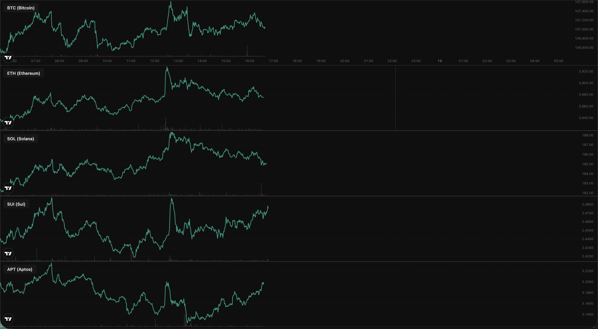

# Charts

## Cryptocurrency Trading Charts

A collection of real-time cryptocurrency trading charts powered by TradingView widgets, deployed on GitHub Pages.

## 🚀 Live Demo

View the live charts here: **[https://harikiranvusirikala.github.io/charts/](https://harikiranvusirikala.github.io/charts/)**

### Available Views

- **[Day View](https://harikiranvusirikala.github.io/charts/crypto/day.html)** - 1-day interval charts
- **[5-Day View](https://harikiranvusirikala.github.io/charts/crypto/5day.html)** - 5-day interval charts

## 📸 Screenshots

### Day View

*Real-time cryptocurrency charts with 1-day interval showing BTC, ETH, SOL, SUI, and APT*

## 📊 Featured Cryptocurrencies

Default charts track the following cryptocurrencies:

- **BTC** (Bitcoin) - BINANCE:BTCUSD
- **ETH** (Ethereum) - BINANCE:ETHUSD
- **SOL** (Solana) - BINANCE:SOLUSD
- **SUI** (Sui) - COINBASE:SUIUSD
- **APT** (Aptos) - COINBASE:APTUSD

## 🎯 Custom Symbols via URL

You can now customize which cryptocurrencies to display by passing symbols through URL parameters:

### Usage

Add a `symbols` query parameter with comma-separated trading pairs:

```
d.html?symbols=BINANCE:BTCUSD|1D,BINANCE:ETHUSD|1D,COINBASE:SOLUSD|1D
```

### Examples

**Day View with custom symbols:**
```
https://harikiranvusirikala.github.io/charts/crypto/d.html?symbols=BINANCE:BTCUSD|1D,BINANCE:ETHUSD|1D
```

**5-Day View with custom symbols:**
```
https://harikiranvusirikala.github.io/charts/crypto/5d.html?symbols=BINANCE:BTCUSD|5D,COINBASE:APTUSD|5D
```

### Supported Formats

- **Binance:** `BINANCE:XXXUSD|1D` or `BINANCE:XXXUSD|5D`
- **Coinbase:** `COINBASE:XXXUSD|1D` or `COINBASE:XXXUSD|5D`
- **Other exchanges:** Follow TradingView's symbol format

**Note:** Use `|1D` for day view and `|5D` for 5-day view to match the page's timeframe.

## ✨ Features

- 📈 Real-time price data from Binance and Coinbase
- 🎨 Dark theme UI with consistent styling
- 📱 Mobile-responsive design
- 📊 Volume indicators
- 🔄 Auto-updating charts
- ⚡ Multiple timeframe options (1D, 5D)
- 🔗 **Dynamic symbol loading via URL parameters**
- 🏷️ Automatic label extraction from symbols
- 🎯 Configurable chart views without code changes

## 🛠️ Technology

- **TradingView Widget API** - Embedded chart widgets
- **GitHub Pages** - Static hosting
- **Pure HTML/CSS** - Lightweight and fast

## 📝 License

MIT License - see [LICENSE](LICENSE) file for details

## 👤 Author

**[Hari Kiran Vusirikala](https://linkedin.com/in/hari-kiran-vusirikala/)**

---

*Last updated: October 18, 2025*